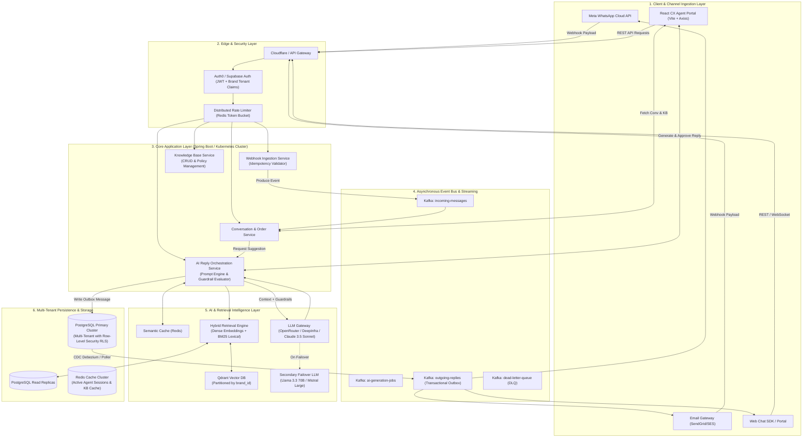

# Datastraw Technologies Assessment Test
## High-Level Design (HLD) & System Architecture Document
**System:** AI-Powered Multi-Brand CX Reply Assistant at Scale  
**Scale Target:** 500 Brands | 5,000 CX Agents | Millions of Customer Messages / Month  
**Author:** Pratik Jatale  
**Document Version:** 1.0 (Production-Ready)

---

## 1. Executive Architecture Diagram

The diagram below illustrates the end-to-end event-driven architecture designed to support 500 brands, 5,000 active agents, and millions of customer interactions across Meta WhatsApp, Email, and Web Chat with sub-second retrieval and strict multi-tenant isolation.



---

## 2. Architectural Subsystem Breakdown

### 2.1. Frontend Architecture
- **Tech Stack:** React 19, TypeScript, Vite, Axios, Lucide Icons, Modular CSS Design System.
- **Responsibilities:**
  - **Live Conversation View:** Real-time customer chat stream, order context drawer (Order ID, placed date, delivery age in days, item summary, order status).
  - **Testing Perspective Switcher:** Instant toggle between **Customer View** (to send live inquiries) and **Agent View** (to review and draft responses) to test end-to-end feedback loops without needing external phone devices.
  - **Brand Knowledge Base Manager:** Granular CRUD modal for brand policies with category filters (`RETURN`, `REFUND`, `SHIPPING`, `CANCELLATION`, `GENERAL`). Any policy change immediately updates retrieval without restarting backend services.
  - **AI Copilot Drawer:** Displays AI suggestion, edit status tag, model badge, strict guardrail banner, and collapsible raw retrieved knowledge citations.
  - **Network Resilience:** Centralized Axios instance with client correlation IDs, response normalization, and clear connection state tracking.

### 2.2. APIs & Backend (Spring Boot Core Services)
- **Design Pattern:** Modular Hexagonal Monolith / Domain-Driven Design (prepared for microservices decomposition as traffic scales).
- **Core Endpoints:**
  - `GET /api/brands`: List supported brands and brand tone guidelines.
  - `GET /api/conversations`: Fetch customer conversations with order data.
  - `POST /api/conversations/{id}/messages`: Ingest messages from Customer or Agent.
  - `GET /api/knowledge-base/brand/{brandId}`: Brand-isolated policy queries.
  - `POST /api/knowledge-base`: Brand policy authoring and vector re-indexing.
  - `POST /api/ai/generate-reply`: RAG context retrieval, prompt construction, guardrail evaluation, and LLM invocation.
  - `POST /api/ai/approve-reply`: Agent audit trail recording, message state update, and customer delivery dispatch.
- **Observability:** Spring Boot Actuator (`/actuator/health`, `/actuator/metrics`), OpenTelemetry distributed tracing, and structured JSON logs.

### 2.3. Multi-Brand Data Isolation (Brand A vs. Brand B Boundary)
A fatal bug in enterprise CX software is leaking Brand A's proprietary refund rules or customer messages to Brand B. We enforce isolation across four distinct layers:

1. **Authentication Token Claim (Gateway Layer):**
   - JWT tokens issued to agents contain signed claims: `{ "sub": "agent_123", "brand_id": 1, "role": "AGENT" }`.
   - The Spring Security Filter extracts `brand_id` and populates a thread-local `SecurityContext`.
2. **PostgreSQL Row-Level Security (RLS) (Database Layer):**
   - Every core table (`conversations`, `messages`, `knowledge_articles`, `orders`, `interaction_logs`) contains a non-nullable `brand_id INT REFERENCES brands(id)`.
   - PostgreSQL RLS policy:
     ```sql
     ALTER TABLE knowledge_articles ENABLE ROW LEVEL SECURITY;
     CREATE POLICY brand_isolation_policy ON knowledge_articles
     FOR ALL TO application_role
     USING (brand_id = current_setting('app.current_brand_id')::INT);
     ```
   - Before executing queries, the connection pool checkout sets `app.current_brand_id`.
3. **Application Service Defense (Repository Layer):**
   - All Spring Data JPA repository queries include explicit brand parameters (e.g., `findByBrandIdAndCategory(...)`), preventing accidental cross-tenant queries.
4. **Vector Database Partitioning (Vector Layer):**
   - Qdrant collections use payload filters with an indexed `brand_id` payload field:
     ```json
     {
       "filter": {
         "must": [{ "key": "brand_id", "match": { "value": 1 } }]
       }
     }
     ```
   - An embedding search for Brand A never scans vectors indexed for Brand B.

---

## 3. AI Reliability, Retrieval & Guardrails

### 3.1. Knowledge Retrieval Strategy
- **Hybrid Search:** Combines dense semantic vector retrieval (Qdrant using `text-embedding-3-small` or `bge-large-en-v1.5`) with exact lexical matching (BM25 full-text search in PostgreSQL).
  - *Dense vectors* capture semantic variations ("bottle cracked", "leaking liquid" $\rightarrow$ Damaged Item Policy).
  - *BM25 lexical search* captures exact model numbers and serial codes ("VOLT-ANC-PRO", "7 days").
- **Dynamic Context Assembly:** Retrieved chunks are deduplicated and ranked using a Reciprocal Rank Fusion (RRF) algorithm before being injected into the system prompt.

### 3.2. Hallucination Prevention & Prompt Grounding
The LLM is strictly constrained via system prompt instructions:
```text
You are a customer experience assistant for {{brand_name}}.
Tone and Voice: {{tone_guidelines}}

CRITICAL GROUNDING RULES:
1. ONLY use information explicitly stated in the RETRIEVED POLICIES below.
2. If the customer inquiry cannot be answered by the retrieved policies, you MUST state that you do not have this information and recommend escalating to a human lead.
3. NEVER promise a refund, replacement, or monetary credit if the customer's order condition exceeds the policy timeline.
4. Always verify order delivery dates against the policy return window.

ORDER CONTEXT:
Order #: {{order_number}} | Delivered: {{delivery_date}} ({{days_since_delivery}} days ago)

RETRIEVED POLICIES:
{{retrieved_policy_chunks}}
```

### 3.3. Confidence & Fallback Mechanisms
- **Policy Violation Check (e.g., 20 days vs. 7-day refund window):**
  - If the order was delivered 20 days ago and the retrieved damaged-item policy restricts claims to 7 days, the deterministic Guardrail Engine flags the response with `POLICY_VIOLATION`.
  - The suggested response politely explains the 7-day limit while offering escalation to a team lead.
- **Knowledge Base Gap (No Policy Found):**
  - If hybrid retrieval returns a similarity score below 0.65 for all documents, the system triggers `NO_POLICY_FOUND`.
  - Rather than making up rules, the AI generates a neutral acknowledgment and notifies the agent to formulate a manual response.

### 3.4. Evaluation & Human-in-the-Loop Audit
- Every AI generation is logged into `ai_interaction_logs` along with:
  1. Customer inquiry
  2. Retrieved policy chunks
  3. Raw AI response draft
  4. Agent-edited response (if modified)
  5. Edit distance / diff score
  6. Final approved message sent to customer
- When agents edit the AI suggestion significantly, that diff is flagged for review to discover missing or ambiguous policy articles.

---

## 4. Scalability: Moving from 20 Brands to 500 Brands

When growing from 20 to 500 brands and 5,000 agents handling millions of customer messages, architectural bottlenecks shift from code logic to state, persistence, and external rate limits:

| Potential Bottleneck | What Breaks at 500 Brands | Architectural Solution |
| :--- | :--- | :--- |
| **PostgreSQL Connection Pool Exhaustion** | 5,000 agents sending simultaneous requests saturate DB connections ($>500$ open sockets). | Deploy **PgBouncer** in transaction pooling mode. Offload read traffic to PostgreSQL Read Replicas. |
| **Vector DB Search Latency** | Querying a single flat vector index across 500 brands causes index scan contention and high latency. | Use **Qdrant tenant payload partitioning** (`brand_id` indexed shard keys). Isolate namespaces per brand. |
| **LLM Provider Rate Limits** | Reaching OpenRouter/Anthropic rate limits (TPM/RPM) causes 429 throttling and message drops. | Implement an **LLM Gateway** with connection pooling, semantic caching, token buckets, and multi-provider automatic failover (OpenRouter $\rightarrow$ DeepInfra $\rightarrow$ Bedrock). |
| **WebSocket / Push Server Saturation** | Maintaining 5,000 persistent agent sockets on a single server exhausts memory and file descriptors. | Use **Redis Pub/Sub** or **AWS API Gateway WebSocket** with auto-scaled stateless WebSocket pods. |
| **Full Table Scans on Ingest** | Millions of messages in a single monolithic table slow down conversation history queries. | **Range partitioning by `created_at`** (monthly partitions) and composite indexing on `(brand_id, customer_id, created_at)`. |

---

## 5. System Reliability & Edge Case Engineering

### 5.1. Webhook Received Twice (Duplicate Ingestion)
- **Problem:** Meta WhatsApp webhook retries due to network jitter, potentially generating duplicate AI replies.
- **Solution:**
  1. The Webhook Gateway extracts the unique message ID: `wamid.HBgL...`.
  2. Gateway attempts an atomic Redis `SET NX EX`:
     ```redis
     SET webhook_dedup:wamid_123 "PROCESSED" NX EX 86400
     ```
  3. If Redis returns `nil`, the duplicate webhook is acknowledged with `200 OK` and immediately discarded without queuing.

### 5.2. External API Timed Out (WhatsApp / LLM / E-Commerce)
- **Problem:** LLM inference or Shopify API takes $>5$ seconds, blocking HTTP threads.
- **Solution:**
  - Wrap external network calls with **Resilience4j Circuit Breakers**:
    - Request timeout: 4,000ms.
    - Failure rate threshold: 50% over a sliding window of 10 requests opens the circuit.
  - When the circuit opens, fall back immediately to an asynchronous background worker or a cached template, preventing thread exhaustion.

### 5.3. AI Request Failed (500 Error / Model Downtime)
- **Problem:** The upstream LLM provider is down.
- **Solution:**
  - Secondary failover: The LLM client automatically switches from primary (e.g. Claude 3.5 Sonnet) to backup (e.g. Llama-3.3-70B on DeepInfra).
  - If all LLM providers fail, the system renders a graceful fallback notification: *"AI Assistant is temporarily unavailable. Standard brand policy guidelines have been retrieved below for manual review."*

### 5.4. Message Processed, But Response Not Sent (Network Interruption)
- **Problem:** Agent approves reply, DB commits, but network drops before sending to Meta WhatsApp API.
- **Solution:** **Transactional Outbox Pattern**:
  1. When an agent approves a reply, the DB transaction saves the message and an outbox event in the same ACID transaction:
     ```sql
     INSERT INTO messages (...);
     INSERT INTO outbox_events (aggregate_type, event_payload, status) VALUES ('WHATSAPP_SEND', '...', 'PENDING');
     ```
  2. A dedicated Outbox Relay (via Debezium CDC or high-speed poller) reads pending events and streams them to Kafka.
  3. A delivery worker consumes Kafka, calls the Meta WhatsApp API, and marks the event as `SENT`. If WhatsApp is unreachable, the event retries with exponential backoff up to 5 times before routing to a Dead Letter Queue (DLQ).

---

## 6. Part 3: Technical Problem Solving — AI Cost Investigation

### Scenario:
*Datastraw's AI costs jumped from ₹20,000/month to ₹1,00,000/month (5x increase) over three months, while customer volume and conversations increased by only 40%.*

### Root Cause Investigation Checklist:
1. **Prompt Token Inflation (History Accumulation):**
   - *Hypothesis:* Frontend/backend sends the entire conversation history without truncation on every regeneration, turning 500-token calls into 6,000-token calls for long threads.
   - *Investigation:* Inspect OpenTelemetry / Langfuse token tracking logs to evaluate average prompt tokens per request over time.
2. **Model Selection Overkill:**
   - *Hypothesis:* All simple inquiries (e.g., "Where is my order?", "Do you ship to California?") use expensive models ($15/million tokens) instead of lightweight models ($0.15/million tokens).
3. **Agent Regeneration Loops:**
   - *Hypothesis:* Agents repeatedly click "Regenerate" because initial drafts are unsatisfactory due to unclear brand guidelines.
4. **Redundant Vector & Embedding Calls:**
   - *Hypothesis:* Re-embedding static knowledge base policies on every search instead of caching query embeddings or utilizing semantic response caching.

### Remediation & Cost Reduction Plan:

```mermaid
graph LR
    UserMsg["Customer Inquiry"] --> Router{"Prompt Classifier<br/>(Query Complexity)"}
    Router -->|Simple Query / FAQ| CacheCheck{"Semantic Cache Check<br/>(Redis + Cosine Sim)"}
    CacheCheck -->|Cache Hit (>95%)| ReturnCached["Return Cached Response<br/>(Cost: ₹0.00)"]
    CacheCheck -->|Cache Miss| SmallModel["Tier-1 Light Model<br/>(Llama 3.2 3B / GPT-4o-mini)<br/>(Cost: ~₹0.02)"]
    Router -->|Complex / Damaged / Dispute| LargeModel["Tier-2 Reasoning Model<br/>(Claude 3.5 Sonnet)<br/>(Cost: ~₹0.35)"]
```

1. **Semantic Response Caching (Redis + Vector Sim):**
   - High-volume recurring queries (e.g., standard shipping times, return window questions) are cached using semantic embeddings. Queries with $>95\%$ cosine similarity to an approved response return the cached response with zero LLM API cost.
2. **Model Tiering & Dynamic Routing:**
   - Route simple status lookups to Tier-1 models (`gpt-4o-mini` or `llama-3.2-3b-instruct`).
   - Reserve Tier-2 models (`claude-3.5-sonnet`) solely for complex multi-policy disputes or damaged goods complaints.
3. **Context Truncation & Summarization:**
   - Restrict conversation context to the latest 3 turns + structured Order Summary.
   - Chunk knowledge base policies to 200 tokens each rather than injecting entire brand manuals.
4. **Guardrail-Enforced Regeneration Rate Limiting:**
   - Limit agents to 2 auto-regenerations per message; subsequent requests require specific steering instructions.
- **Projected Result:** Drops monthly spend from ₹1,00,000 back down to $\approx$ ₹28,000-₹32,000/month while maintaining 40% increased volume.

---

## 7. Part 4: Leadership & Ownership Framework

### 1. Junior Developer Submitting Working but Poorly Structured Code
- **Approach:**
  - Avoid repeating generic verbal criticism. Schedule a 45-minute collaborative pair-programming session.
  - Review a concrete PR together: show how poor structure makes unit testing difficult, increases cyclomatic complexity, and makes future bug-fixes error-prone.
  - Introduce concrete tools: automated linter rules (e.g., SonarQube, Oxlint), automated pre-commit hooks, and a standardized "definition of done" for PR templates.

### 2. Resolving Architectural Disagreements
- **Approach:**
  - Shift discussion from personal opinions to objective trade-off evaluation matrices.
  - Create a lightweight Request for Comments (RFC) document listing:
    1. Operational complexity
    2. Scalability at 500 brands
    3. Latency benchmarks
    4. Maintenance overhead
  - Run a timeboxed 1-day spike or benchmark. If both approaches are viable, decide based on alignment with the team's long-term operational capabilities.

### 3. Technical Mistake & Ownership
- **Scenario:** An unindexed foreign key column in a migration triggered a table lock on the `messages` table in production during peak hours, causing a 4-minute API degradation.
- **Actions Taken:**
  1. Immediately identified the lock query, killed blocked PID connections, and added the index concurrently (`CREATE INDEX CONCURRENTLY`).
  2. Authored an open blameless post-mortem for the engineering team detailing the sequence of events.
  3. Added an automated Flyway migration linter in CI/CD that rejects any unindexed foreign keys or blocking DDL operations before merging.

### 4. Joining Datastraw: First 30 Days Blueprint
- **Days 1–10 (Observe & Map):**
  - Shadow customer support agents directly for 4 hours to experience daily friction and workflow gaps.
  - Map current architecture, data flows, CI/CD pipelines, and cloud expenditure.
- **Days 11–20 (Identify Quick Wins & Align):**
  - Unblock immediate developer pain points (e.g., brittle local setups, missing Swagger documentation).
  - Draft initial RFCs for high-impact architecture priorities (such as multi-brand RLS isolation and semantic caching).
- **Days 21–30 (Deliver & Set Standards):**
  - Ship one meaningful, production-verified improvement (e.g., standardizing the AI interaction logging pipeline).
  - Establish weekly engineering syncs, architectural review standards, and a clear roadmap for scaling from prototype to enterprise-grade infrastructure.
